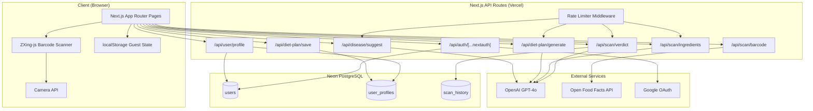
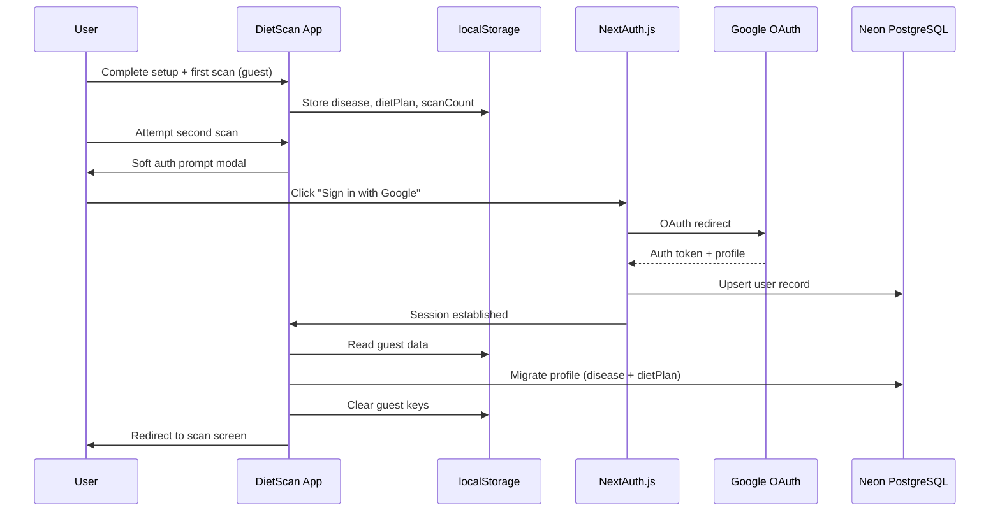

# Design Document: DietScan MVP

## Overview

DietScan is a mobile-first Progressive Web App that helps people with medical conditions make safe food choices while grocery shopping. The system follows a four-step user journey: disease selection → AI diet plan generation → food scanning → verdict display. It uses a guest-first authentication strategy where users experience the core value (one free scan) before being prompted to sign in.

The architecture is a Next.js 14 App Router application deployed on Vercel, backed by Neon PostgreSQL via Prisma ORM, with OpenAI GPT-4o powering three AI features (disease suggestions, diet plan generation, and ingredient OCR). Barcode scanning runs entirely client-side via ZXing-js, and product data comes from the Open Food Facts API.

Key design priorities:
- Zero-friction onboarding (guest-first, no auth for first scan)
- Robust localStorage-to-database migration on sign-in with no data loss
- Admin-configurable rate limits via environment variables
- Prominent medical disclaimer throughout the app
- Mobile-first responsive design optimized for in-store use

## Architecture



### Request Flow: Barcode Scan to Verdict

```mermaid
sequenceDiagram
    participant U as User
    participant B as BarcodeScanner (ZXing)
    participant API as Next.js API
    participant OFF as Open Food Facts
    participant AI as OpenAI GPT-4o
    participant DB as Neon PostgreSQL

    U->>B: Point camera at barcode
    B->>B: Decode barcode (client-side)
    B->>API: POST /api/scan/barcode {barcode}
    API->>OFF: GET /product/{barcode}.json
    OFF-->>API: Product data (name, nutrients, ingredients)
    API-->>B: Product data response
    B->>API: POST /api/scan/verdict {product, disease, dietPlan}
    API->>AI: Analyze food against diet plan
    AI-->>API: {verdict, reason, flaggedNutrients}
    API-->>U: Display verdict screen
    opt Authenticated User
        API->>DB: INSERT scan_history
    end
```

### Authentication & Migration Flow



## Components and Interfaces

### Page Components (App Router)

| Route | Component | Purpose |
|-------|-----------|---------|
| `/` | `page.tsx` | Landing/redirect: authenticated users → `/scan`, new users → `/setup` |
| `/setup` | `setup/page.tsx` | Disease selection with AI auto-suggest typeahead |
| `/setup/diet-plan` | `setup/diet-plan/page.tsx` | Diet plan review, editing, and confirmation |
| `/scan` | `scan/page.tsx` | Camera viewfinder with barcode/ingredient scan modes |
| `/scan/result` | `scan/result/page.tsx` | Verdict display with product details |
| `/(auth)/signin` | `signin/page.tsx` | Custom Google sign-in page |

### UI Components

| Component | Location | Props/Interface |
|-----------|----------|-----------------|
| `DiseaseSearchInput` | `components/disease/` | `onSelect: (disease: string) => void` — typeahead input with 400ms debounce |
| `SuggestionDropdown` | `components/disease/` | `suggestions: string[], loading: boolean, onSelect: (s: string) => void` |
| `DietPlanCard` | `components/diet-plan/` | `plan: DietPlan, editable: boolean, onSave: (plan: DietPlan) => void` |
| `FoodChipList` | `components/diet-plan/` | `items: string[], color: 'red'|'green', removable: boolean, onRemove, onAdd` |
| `NutrientTargetGrid` | `components/diet-plan/` | `nutrients: Record<string, string>` |
| `BarcodeScanner` | `components/scanner/` | `onDecode: (barcode: string) => void, onError: (err: Error) => void` |
| `CameraViewfinder` | `components/scanner/` | `active: boolean` — camera overlay UI |
| `ScanModeToggle` | `components/scanner/` | `mode: 'barcode'|'ingredient', onChange: (mode) => void` |
| `VerdictBanner` | `components/verdict/` | `verdict: Verdict, reason: string` |
| `ProductCard` | `components/verdict/` | `product: ProductData` |
| `NutrientBreakdown` | `components/verdict/` | `nutrients: NutrientMap, flagged: string[]` |
| `AuthPromptModal` | `components/auth/` | `mode: 'soft'|'hard', onSignIn, onDismiss` |
| `MedicalDisclaimer` | `components/ui/` | Stateless — renders disclaimer text |

### Custom Hooks

| Hook | Purpose | Interface |
|------|---------|-----------|
| `useGuestState` | Manages localStorage for guest disease/dietPlan/scanCount | `{ disease, dietPlan, scanCount, setDisease, setDietPlan, incrementScan, clearAll }` |
| `useDiseaseSearch` | Debounced API calls to `/api/disease/suggest` | `{ suggestions, loading, error, search: (query: string) => void }` |
| `useScanCount` | Tracks guest scan count, determines auth gate level | `{ count, shouldShowSoftPrompt, shouldShowHardGate, increment }` |

### API Route Interfaces

```typescript
// POST /api/disease/suggest
interface DiseaseSuggestRequest { query: string }
interface DiseaseSuggestResponse { suggestions: string[] }

// POST /api/diet-plan/generate
interface DietPlanGenerateRequest { diseaseName: string }
interface DietPlanGenerateResponse { dietPlan: DietPlan }

// POST /api/diet-plan/save
interface DietPlanSaveRequest { diseaseName: string; dietPlan: DietPlan; isCustomized: boolean }
interface DietPlanSaveResponse { success: boolean }

// POST /api/scan/barcode
interface BarcodeLookupRequest { barcode: string }
interface BarcodeLookupResponse { found: boolean; product?: ProductData }

// POST /api/scan/ingredients
interface IngredientOCRRequest { imageBase64: string }
interface IngredientOCRResponse { ingredients: string[]; rawText: string }

// POST /api/scan/verdict
interface VerdictRequest {
  diseaseName: string
  dietPlan: DietPlan
  product: { name: string; ingredients: string[]; nutrients: NutrientMap }
}
interface VerdictResponse {
  verdict: 'SAFE' | 'CAUTION' | 'AVOID'
  reason: string
  flaggedNutrients: string[]
  safeAlternative?: string
}

// GET /api/user/profile
interface UserProfileResponse { diseaseName: string; dietPlan: DietPlan; isCustomized: boolean }

// PUT /api/user/profile
interface UserProfileUpdateRequest { dietPlan: DietPlan; isCustomized: boolean }
```

### Rate Limiter Middleware

The rate limiter is a server-side middleware applied to all AI-powered API routes. Limits are configurable via environment variables:

```typescript
// Environment variables for rate limiting
RATE_LIMIT_DISEASE_SUGGEST=10    // requests per minute per user/IP
RATE_LIMIT_DIET_PLAN_GENERATE=5  // requests per minute per user/IP
RATE_LIMIT_INGREDIENT_OCR=10     // requests per minute per user/IP
RATE_LIMIT_VERDICT=20            // requests per minute per user/IP
RATE_LIMIT_WINDOW_MS=60000       // window size in milliseconds
```

Implementation uses an in-memory store (Map) keyed by user ID (authenticated) or IP address (guest). Each entry tracks request timestamps within the sliding window. On Vercel, this is per-instance — acceptable for MVP since it provides soft protection against abuse without requiring Redis.

### localStorage-to-Database Migration Service

The migration runs in the NextAuth `signIn` callback and the client-side post-auth effect:

1. Client reads `dietscan_disease`, `dietscan_diet_plan`, `dietscan_guest_scans` from localStorage
2. Client sends migration payload to `POST /api/diet-plan/save`
3. Server wraps the upsert in a database transaction:
   - Check if user already has a profile (returning user re-auth scenario)
   - If no profile exists: create `UserProfile` with guest data
   - If profile exists: skip migration (don't overwrite existing DB data)
4. On successful server response: client clears all `dietscan_*` localStorage keys
5. On failure: client retains localStorage data and retries on next page load
   - A `dietscan_migration_pending` flag is set to trigger retry

Error handling priorities:
- Never delete localStorage before confirmed DB write
- Never overwrite existing DB profile with stale localStorage data
- Log migration failures for debugging but don't block the user

## Data Models

### Prisma Schema

```prisma
model User {
  id            String    @id @default(cuid())
  email         String    @unique
  name          String?
  image         String?
  googleId      String?   @unique
  createdAt     DateTime  @default(now())
  updatedAt     DateTime  @updatedAt

  profile       UserProfile?
  scanHistory   ScanHistory[]

  @@map("users")
}

model UserProfile {
  id            String    @id @default(cuid())
  userId        String    @unique
  user          User      @relation(fields: [userId], references: [id], onDelete: Cascade)
  diseaseName   String
  dietPlan      Json      // { avoid: string[], prefer: string[], watch: string[], nutrients: Record<string, string> }
  isCustomized  Boolean   @default(false)
  createdAt     DateTime  @default(now())
  updatedAt     DateTime  @updatedAt

  @@map("user_profiles")
}

model ScanHistory {
  id            String      @id @default(cuid())
  userId        String
  user          User        @relation(fields: [userId], references: [id], onDelete: Cascade)
  productName   String?
  brand         String?
  barcode       String?
  scanMethod    ScanMethod  // BARCODE | INGREDIENT_OCR
  verdict       Verdict     // SAFE | CAUTION | AVOID
  verdictDetail Json?       // { reason: string, flaggedNutrients: string[], ingredients: string[] }
  scannedAt     DateTime    @default(now())

  @@index([userId])
  @@index([scannedAt])
  @@map("scan_history")
}

enum ScanMethod {
  BARCODE
  INGREDIENT_OCR
}

enum Verdict {
  SAFE
  CAUTION
  AVOID
}
```

### TypeScript Types

```typescript
// src/types/diet.ts
interface DietPlan {
  avoid: string[]
  prefer: string[]
  watch: string[]
  nutrients: Record<string, string>
}

type VerdictType = 'SAFE' | 'CAUTION' | 'AVOID'

interface FoodVerdict {
  verdict: VerdictType
  reason: string
  flaggedNutrients: string[]
  safeAlternative?: string
}

// src/types/scan.ts
interface ProductData {
  name: string
  brand: string
  ingredients: string[]
  nutrients: NutrientMap
  servingSize: string
}

interface NutrientMap {
  sodium: number
  sugar: number
  carbohydrates: number
  fat: number
  protein: number
  fiber: number
  saturatedFat: number
  transFat: number
}

type ScanMethodType = 'BARCODE' | 'INGREDIENT_OCR'

interface ScanResult {
  productName?: string
  brand?: string
  barcode?: string
  scanMethod: ScanMethodType
  verdict: FoodVerdict
}
```

### localStorage Schema (Guest State)

| Key | Type | Description |
|-----|------|-------------|
| `dietscan_disease` | `string` | Selected disease name |
| `dietscan_diet_plan` | `string` (JSON) | Serialized `DietPlan` object |
| `dietscan_guest_scans` | `string` (number) | Count of scans performed as guest |
| `dietscan_migration_pending` | `string` ("true") | Flag indicating failed migration needs retry |

### Key Design Decisions

1. **`dietPlan` as JSON column**: The AI-generated diet plan structure is flexible and may evolve. Storing as a JSON column in PostgreSQL avoids rigid relational modeling for inherently dynamic medical data. Prisma's `Json` type provides type-safe access.

2. **No disease table**: Disease intelligence lives entirely in the AI layer. Storing `diseaseName` as plain text means the exact AI-confirmed string is reused verbatim in every subsequent AI call, ensuring consistency.

3. **Lightweight scan history**: Only verdict + product name + reasoning are persisted. Full nutrition data is fetched fresh from Open Food Facts on each scan, avoiding stale cached data.

4. **In-memory rate limiting**: For MVP, an in-memory Map per Vercel instance is sufficient. This provides soft protection without requiring Redis infrastructure. The trade-off is that limits reset on cold starts and aren't shared across instances — acceptable for early-stage abuse prevention.

5. **JWT session strategy**: Stateless JWT sessions work well with Vercel's edge runtime and avoid database session lookups on every request. The user's database ID is embedded in the JWT via NextAuth callbacks.

6. **Migration-safe localStorage cleanup**: localStorage keys are only cleared after confirmed database write success. A `migration_pending` flag enables retry on subsequent page loads if the initial migration fails.

## Correctness Properties

*A property is a characteristic or behavior that should hold true across all valid executions of a system — essentially, a formal statement about what the system should do. Properties serve as the bridge between human-readable specifications and machine-verifiable correctness guarantees.*

### Property 1: Disease suggest returns valid response shape

*For any* query string of 2 or more characters, the Disease_Suggest_Service response SHALL contain a `suggestions` array with between 6 and 8 string elements.

**Validates: Requirements 1.1**

### Property 2: Disease selection populates input

*For any* suggestion string selected from the dropdown, the disease input field value SHALL equal the selected suggestion string exactly.

**Validates: Requirements 1.3**

### Property 3: Any text input allows proceeding

*For any* non-empty string typed into the disease input field, the user SHALL be able to proceed to the diet plan generation step regardless of whether the string is a recognized medical condition.

**Validates: Requirements 1.4**

### Property 4: Diet plan response structure validation

*For any* response from the Diet_Plan_Generator, the returned `dietPlan` object SHALL contain an `avoid` field (string array), a `prefer` field (string array), a `watch` field (string array), and a `nutrients` field (Record<string, string>), with each array being non-empty.

**Validates: Requirements 2.1**

### Property 5: Adding a food item grows the category

*For any* valid DietPlan and any non-empty food item string and any category (avoid, prefer, watch), adding the item to that category SHALL result in the category array length increasing by one and the array containing the added item.

**Validates: Requirements 3.2**

### Property 6: Removing a food item shrinks the category

*For any* valid DietPlan with at least one item in a category, removing an item from that category SHALL result in the category array length decreasing by one and the array no longer containing the removed item.

**Validates: Requirements 3.3**

### Property 7: Editing sets isCustomized flag

*For any* DietPlan that has been modified (item added or removed) and then confirmed, the `isCustomized` flag SHALL be set to `true`.

**Validates: Requirements 3.4**

### Property 8: Diet plan persistence round-trip

*For any* valid DietPlan, saving it to the persistence layer (database for authenticated users, localStorage for guests) and then loading it back SHALL produce a DietPlan that is deeply equal to the original.

**Validates: Requirements 3.5, 3.6**

### Property 9: Nutrient per-100g to per-serving conversion

*For any* nutrient value `v` (non-negative number) per 100g and any serving size `s` (positive number in grams), the per-serving value SHALL equal `v * s / 100`.

**Validates: Requirements 5.2**

### Property 10: Decoded barcode is forwarded to product lookup

*For any* barcode string successfully decoded by the Barcode_Scanner, the exact same barcode string SHALL be passed to the Product_Lookup_Service without modification.

**Validates: Requirements 4.2**

### Property 11: Extracted ingredients are forwarded to verdict

*For any* non-empty ingredients array returned by the Ingredient_OCR_Service, the same array SHALL be passed to the Verdict_Analyzer for analysis.

**Validates: Requirements 6.2**

### Property 12: Verdict response contains required fields

*For any* verdict response from the Verdict_Analyzer, it SHALL contain a `verdict` field with value "SAFE", "CAUTION", or "AVOID", a non-empty `reason` string, and a `flaggedNutrients` string array. Additionally, *for any* verdict that is "CAUTION" or "AVOID", the response SHALL also contain a non-empty `safeAlternative` string.

**Validates: Requirements 7.1, 7.2**

### Property 13: Verdict display contains all required information

*For any* verdict response, the rendered verdict screen SHALL contain the product name, brand, verdict banner, reasoning text, and all flagged nutrient names.

**Validates: Requirements 7.3**

### Property 14: Scan history persistence round-trip

*For any* authenticated user scan result, saving it to the Scan_History_Service and then querying the user's scan history SHALL return a record containing the same product name, verdict, scan method, and verdict detail.

**Validates: Requirements 7.4**

### Property 15: Auth gate behavior by scan count

*For any* guest scan count value `n`, the Auth_Gate SHALL show no prompt when `n == 0`, a soft dismissible prompt when `n == 1`, and a hard blocking gate when `n >= 2`.

**Validates: Requirements 8.1, 8.2, 8.3**

### Property 16: Migration transfers data and clears localStorage

*For any* guest user with disease name and diet plan stored in localStorage, after successful sign-in and migration, the database SHALL contain a UserProfile with the same disease name and diet plan, and all `dietscan_*` localStorage keys SHALL be cleared.

**Validates: Requirements 9.1, 9.2**

### Property 17: Migration is idempotent for existing profiles

*For any* user who already has a UserProfile in the database, triggering the migration service SHALL not modify the existing database profile data.

**Validates: Requirements 9.4**

### Property 18: Rate limiter enforces configured limits

*For any* API route with a configured rate limit of `N` requests per window, sending `N+1` requests within the window SHALL result in the `(N+1)`th request receiving a 429 status code, while the first `N` requests succeed.

**Validates: Requirements 10.1, 10.2**

## Error Handling

### API Error Strategy

All API routes follow a consistent error response format:

```typescript
interface ApiErrorResponse {
  error: string    // Human-readable error message
  code: string     // Machine-readable error code
  retryable: boolean
}
```

| Error Scenario | HTTP Status | Code | Retryable | User-Facing Behavior |
|---------------|-------------|------|-----------|---------------------|
| OpenAI API failure | 502 | `AI_SERVICE_ERROR` | Yes | "Something went wrong. Tap to retry." |
| OpenAI rate limit | 429 | `AI_RATE_LIMITED` | Yes (after delay) | "Too many requests. Please wait a moment." |
| Open Food Facts timeout | 504 | `PRODUCT_LOOKUP_TIMEOUT` | Yes | "Product lookup timed out. Tap to retry." |
| Barcode not found | 404 | `PRODUCT_NOT_FOUND` | No | Offer ingredient OCR fallback |
| OCR extraction failed | 422 | `OCR_EXTRACTION_FAILED` | Yes | "Couldn't read the label. Try again with better lighting." |
| Invalid request body | 400 | `VALIDATION_ERROR` | No | Show specific field errors |
| Unauthorized | 401 | `UNAUTHORIZED` | No | Redirect to sign-in |
| Rate limit exceeded | 429 | `RATE_LIMIT_EXCEEDED` | Yes (after window) | "You've made too many requests. Please wait." |
| Database error | 500 | `DATABASE_ERROR` | Yes | "Something went wrong. Tap to retry." |
| Migration failure | 500 | `MIGRATION_ERROR` | Yes (auto-retry) | Silent — retry on next page load |

### Client-Side Error Handling

- All API calls use a shared `fetchWithRetry` utility that handles:
  - Automatic retry with exponential backoff for retryable errors (max 3 attempts)
  - Toast notifications for user-facing errors
  - Error boundary at the page level for unhandled exceptions
- Camera errors (permission denied, no camera) show inline messages on the scan screen, not modals
- localStorage errors (quota exceeded, private browsing) fall back gracefully — guest state features degrade but don't crash

### Migration Error Handling (Critical Path)

The localStorage-to-database migration is the most error-sensitive flow:

1. **Pre-migration validation**: Verify localStorage data is parseable JSON before attempting migration
2. **Atomic database write**: Use Prisma transaction to ensure profile creation is all-or-nothing
3. **Post-write verification**: Read back the created profile to confirm write success before clearing localStorage
4. **Failure recovery**: Set `dietscan_migration_pending` flag; retry on next authenticated page load
5. **Conflict resolution**: If user already has a DB profile (e.g., signed in on another device), skip migration silently — DB data takes precedence over localStorage

## Testing Strategy

### Property-Based Testing

Property-based tests use `fast-check` (TypeScript PBT library) with a minimum of 100 iterations per property. Each test is tagged with its design document property reference.

Tag format: **Feature: dietscan-mvp, Property {number}: {property_text}**

Properties to implement as PBT:

| Property | Test Target | Generator Strategy |
|----------|------------|-------------------|
| P1: Suggest response shape | API response validator | Random strings ≥ 2 chars |
| P4: Diet plan structure | DietPlan type validator | Random AI response JSON |
| P5: Add item grows category | `addFoodItem` function | Random DietPlan + random string + random category |
| P6: Remove item shrinks category | `removeFoodItem` function | Random non-empty DietPlan + random existing item |
| P7: Edit sets isCustomized | `confirmDietPlan` function | Random DietPlan with modifications |
| P8: Persistence round-trip | save/load functions | Random valid DietPlan objects |
| P9: Nutrient conversion | `convertNutrientPerServing` | Random non-negative numbers + positive serving sizes |
| P12: Verdict response shape | Verdict response validator | Random verdict responses |
| P15: Auth gate by scan count | `getAuthGateMode` function | Random non-negative integers |
| P17: Migration idempotence | Migration service | Random existing UserProfile + random localStorage data |
| P18: Rate limiter | Rate limiter middleware | Random request sequences with configurable limits |

### Unit Testing

Unit tests use `vitest` and focus on specific examples, edge cases, and integration points:

- Disease search debounce timing (400ms threshold)
- Diet plan editing edge cases (empty categories, duplicate items)
- Nutrient conversion edge cases (zero serving size, missing nutrients)
- Open Food Facts response mapping (missing fields, malformed data)
- Auth gate threshold boundaries (exactly 0, 1, 2 scans)
- localStorage migration with corrupted/missing data
- Rate limiter window boundary behavior
- Medical disclaimer presence on required screens
- Camera permission error states
- Barcode format support verification

### Integration Testing

- Full scan flow: barcode decode → product lookup → verdict → history save
- Guest-to-auth flow: setup as guest → sign in → verify migration → verify scan works
- Diet plan flow: disease select → generate plan → edit → save → reload → verify

### Test Configuration

```typescript
// vitest.config.ts
export default defineConfig({
  test: {
    environment: 'jsdom',
    globals: true,
    setupFiles: ['./src/test/setup.ts'],
  }
})
```

Each correctness property MUST be implemented by a SINGLE property-based test using `fast-check`. Unit tests complement PBT by covering specific examples and edge cases that are hard to express as universal properties (UI rendering, camera lifecycle, error states).
